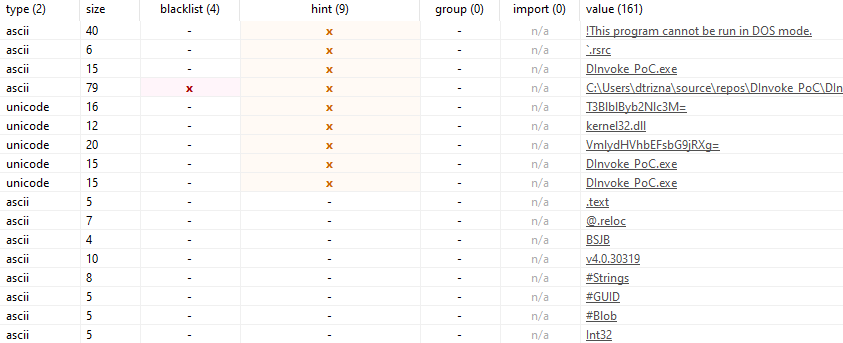
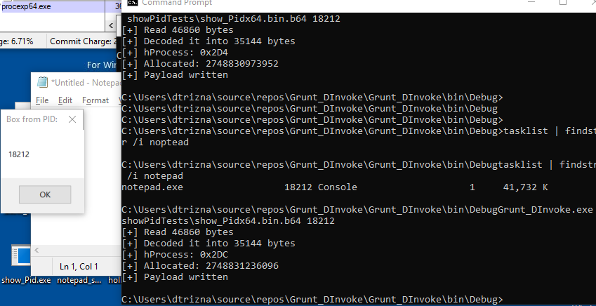
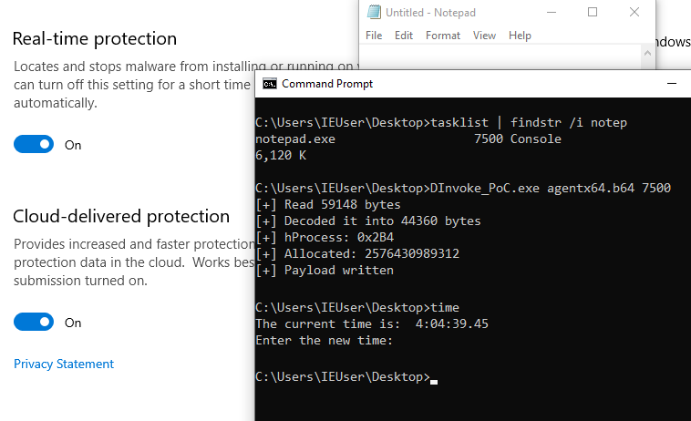

# Hardened Proof of Concept (PoC) of D/Invoke Process Injection logic

This technique implementation uses SharpSploit v1.6 features implemented by @theRealWover and @FuzzySec.
Additional credits goes to @RastaMouse for providing Proof of Concept.


Provided PoC indeed clears up PE import table, where only "_CorExeMain" is seen, and no classic OpenProcess / VirtualAllocEx / WriteProcessMemory / CreateRemoteThread used for process injection.


This repository supplements previously mentioned work with:

1. further obfuscation
2. ready to use PoC files


# 1. Additional obfuscation

Still, API chain is observed in raw PE file itself as a strings:


In order to avoid this behavior change of delegate names is done and base64 encoding of API strings during lookup is performed.

## A. Change of delegate names.
Intended D/Invoke way:
```
[UnmanagedFunctionPointer(CallingConvention.StdCall)]
delegate IntPtr OpenProcess(int dwDesiredAccess, bool bInheritHandle, int dwProcessId);
```

Obfuscated way:
```
[UnmanagedFunctionPointer(CallingConvention.StdCall)]
delegate IntPtr OpPr(int dwDesiredAccess, bool bInheritHandle, int dwProcessId);
```


## B. Change of API method pointer query.
Intended D/Invoke way:
```
var pointer = Generic.GetLibraryAddress("kernel32.dll", "OpenProcess");
```

Obfuscated way:
```
string op = "T3BlblByb2Nlc3M="; // echo -n "OpenProcess" | base64
byte[] openc = System.Convert.FromBase64String(op);
string opdec = Encoding.UTF8.GetString(openc);
var pointer = Generic.GetLibraryAddress("kernel32.dll", opdec);
```

PE after obfuscation:  




# 2. Ready to use PoC files

## Show Pid

Most obvious way to see injection is to display banner displaying own process ID.
This may done by `showPidTests/show_Pidx64.bin.b64` as seen in image above.




## Covenant agent

Provided shellcode is build manually using donut's Python module and callbacks to `192.168.56.110:80` using DefaultHTTPProfile.

Execution with up to date fully functional Windows Defender:



